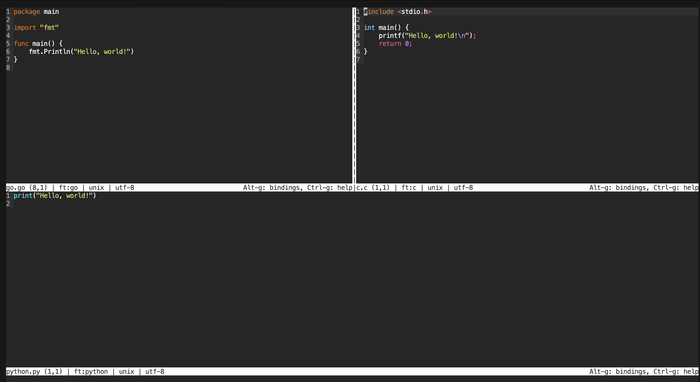

## 1. Introduction

In a terminal environment, having a reliable and user-friendly text editor is essential for efficient work. This is where **Micro** shines. **Micro** is an open-source text editor designed for command-line users seeking a modern and intuitive alternative to classic editors like Vim or Emacs.

{: .shadow }

## 2. What is Micro?

**Micro** is a terminal-based text editor that combines simplicity with powerful features. It offers a clear and user-friendly interface while retaining flexibility for advanced users. Unlike some command-line editors, **Micro** is designed to be immediately accessible without requiring a steep learning curve.

## 3. Why Use Micro?

- **Easy to Get Started**

**Micro** is intuitive, with straightforward and consistent keyboard shortcuts. New users can quickly become comfortable without learning numerous commands.

- **Customizable**

**Micro** supports customization through simple configuration files. You can adjust colors, keyboard shortcuts, and settings to fit your preferences.

- **Extendable with Plugins**

Despite its lightweight nature, **Micro** supports plugins that can extend its capabilities. Whether you need syntax highlighting for different programming languages or project management features, **Micro** can be tailored to your needs.

- **Cross-Platform**

**Micro** works on different platforms including Linux, macOS, and Windows. This makes it ideal for users who want a consistent experience across different operating systems.

- **Performant**

Despite its simplicity, **Micro** is fast and responsive even with large files, making it perfect for quick and efficient text editing tasks.

## 4. How to Install Micro?

### 4.1. Quick-Install Script

Install **Micro** on **Linux** or **Windows** using the following command:

```bash
curl https://getmic.ro | bash
```

### 4.2. Manually Install

However, if you prefer to install **micro** manually, follow these steps according to your operating system.

#### 4.2.1 Linux 

On **Linux** you can install **micro** through **snap**:

```bash
snap install micro --classic
```

**Micro** can also be accessed via various package managers on Linux, including **dnf**, **AUR**, **Nix**, and package managers for other operating systems. However, please note that these packages may not always be the most current versions.

- **Fedora**

```bash
dnf install micro
```
- **Ubuntu and Debian**

```bash
apt install micro 
```

- **Arch Linux**

```bash
pacman -S micro
```

- **Gentoo**

```bash
emerge app-editors/micro
```

- **SUSE**

```bash
zypper install micro-editor
```

- **Solus**

```bash
eopkg install micro
```

- **Pacstall**

```bash
pacstall -I micro
```

#### 4.2.2. Mac

You can install **Micro** using Homebrew on Mac:

```bash
brew install micro
```

#### 4.2.3. Windows

##### 4.2.3.1. Using Scoop

You can install **Micro** using Scoop:

```bash
scoop install micro
``` 

##### 4.2.3.2. Using Chocolatey

You can install **Micro** using Chocolatey:

```bash
choco install micro
``` 

## 5. Usage

**Micro** offers versatile features for efficient text editing directly from the terminal. 

### 5.1. Creating and Editing Files

To open or create a file:

```bash
micro filename.txt
``` 

### 5.2. Basic Text Editing

Use standard keyboard shortcuts for text editing:

-  `Ctrl+S` to save
-  `Ctrl+Q` to quit
-  `Ctrl+C` to copy
-  `Ctrl+V` to paste
-  `Ctrl+X` to cut
-  `Ctrl+Z` to undo
-  `Ctrl+Y` to redo

### 5.3. Command Mode

**Micro** features a command mode for executing various actions and commands. Press `Ctrl+E` to enter command mode, where you can perform 
tasks such as:

- To change your colorscheme:

```bash
set colorscheme twilight
``` 
- To open a horizontal split:

```bash
hsplit {filename}
``` 

- To open a vertical split:

```bash
vsplit {filename}
``` 

### 5.4. Plugins

**Micro** supports plugins that extend its functionality. You can install plugins using the built-in plugin manager:

- Press `Ctrl+E` to enter command mode and execute the following command:
  
```bash
plugin install {plugin_name}
```

### 5.5. Customization

**Micro** is highly customizable through its configuration file `(~/.config/micro/settings.json)`. You can customize key bindings, color schemes, syntax highlighting, and other options to tailor **Micro** to your preferences.

## 6. Start Using Micro Today

If you're looking for a modern and powerful command-line text editor, look no further than **Micro**. Its simplicity, versatility, and performance make it an ideal choice for developers, system administrators, and anyone who spends a lot of time in a terminal.

Try **Micro** today and discover how a minimalist text editor can make your terminal work more efficient than ever!

## 7. References

Below are the links used to write the article: 

- [WebSite](https://micro-editor.github.io/)
- [GitHub](https://github.com/zyedidia/micro#installation)